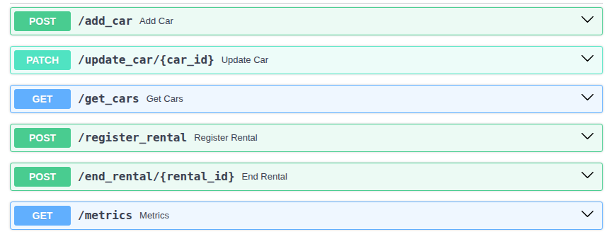
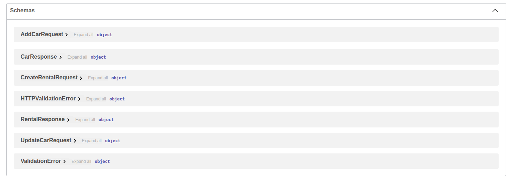
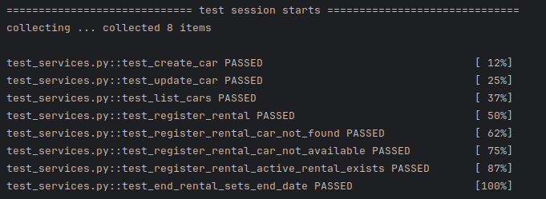
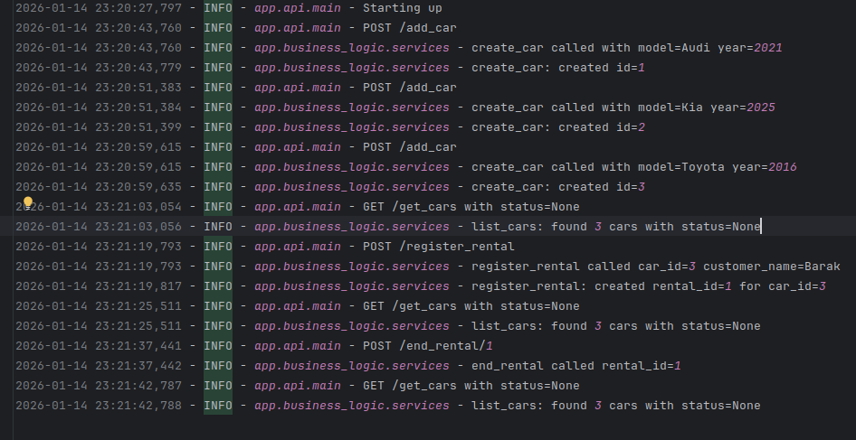

# DriveNow – Vehicle Management System

A simple backend service for managing vehicles and rentals for a car rental company.

This project was created as part of a technical assignment and is designed with clean architecture and future extensibility in mind.

---

## Overview

DriveNow is an internal system that allows:
- Managing vehicles (add, update, list)
- Registering and ending rentals
- Tracking vehicle status (available / in use / under maintenance)

The system is implemented as a REST API using Python.

---

## Architecture Overview

The project follows a layered architecture:

- API Layer – Handles HTTP requests and responses
- Service Layer – Contains business logic
- Data Access Layer – Manages database operations
- Infrastructure – Logging, metrics, and configuration

---

## Architecture Flow (Graphic)
```
Client (Browser / Curl / Swagger)
        |
        v
     API Layer (FastAPI)
        |
        v
   Service Layer (Business Logic)
        |
        v
 Data Access Layer (SQLAlchemy ORM)
        |
        v
     Database (SQLite)
```
This separation keeps the code clean, testable, and easy to extend.

---

## Database Design
-> SQLite was chosen for simplicity and easy setup, since this project is a lightweight backend service and a basis for future expansion.

The system uses a relational database accessed via SQLAlchemy ORM.

### Tables

cars  
- id  
- model  
- year  
- status  

rentals  
- id  
- car_id  
- customer_name  
- start_date  
- end_date  

---

## How to Run the Project

### Option 1: Run Locally

```bash
# Create and activate a virtual environment
python -m venv .venv
source .venv/bin/activate

# If venv is already created and activated, start here:
pip install -r requirements.txt
uvicorn app.api.main:app --reload
```

---

### Option 2: Run with Docker

```bash
docker-compose up --build
```

---

## API Usage

The API is exposed using FastAPI.

*Note: The API endpoints follow a simple naming convention (e.g., /add_car, /get_cars, /register_rental).*


Supported operations:
- Add a new car
- Update car details
- List all cars (optional status filter)
- Register a rental
- End a rental


### Swagger UI (API Documentation)


### Database Schema:



---

## Example Requests

### Add a Car
```
POST /add_car  

# request body
{
  "model": "Toyota Corolla",
  "year": 2022
}
```
---

### List Cars
```
GET /get_cars  
```
---

### Register Rental
```
POST /register_rental  

# request body
{
  "car_id": 1,
  "customer_name": "John Doe"
}
```
---


## Testing

- Unit tests are included
- Tests cover business logic and core flows

### Testing Results Screenshot:



---

## Log example




